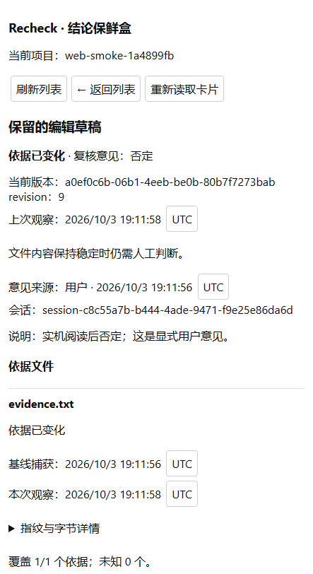

# Recheck

[简体中文](README.md) · [Releases](https://github.com/InInNHD/dsh-recheck/releases) · [Installation](docs/12-installation.md) · [Issues](https://github.com/InInNHD/dsh-recheck/issues)

**Unofficial community project, independently developed and maintained.**

Bind project conclusions to evidence files and revisit them when those files change. Recheck contributes one `recheck` tool and a native DSH right sidebar. Card operations require no additional model calls.

Version: **0.1.0-alpha.2**. Host requirement: **DeepSeek Harness 0.2.0-rc.2**, Node.js **24**. Other host versions are unverified. Windows has real Web/Desktop acceptance evidence. The release adds Windows/Linux CI, packaged install/uninstall/reinstall checks and Linux Web checks; see [verified scope](docs/13-public-release-validation.md). The release remains alpha.



## Install

Download the tgz and SHA-256 checksum from Releases. For Web, run these commands from the download directory with the matching host:

```sh
npx --yes --package=@deepseek-ai/dsh@0.2.0-rc.2 dsh plugin --profile web add ./dsh-recheck-0.1.0-alpha.2.tgz
npx --yes --package=@deepseek-ai/dsh@0.2.0-rc.2 dsh web
```

Use `npx.cmd` in Windows PowerShell. Desktop users install into the `desktop` profile through the application's bundled CLI or plugin manager, then restart Desktop. Do not start the Electron desktop profile with a standalone Web CLI. [Full install, backup, removal and rollback instructions](docs/12-installation.md).

The release tgz includes built files. GitHub's automatically generated source ZIP requires a build. There is no published npm package yet.

## Demo

Create a conclusion card with 1–8 relative evidence paths. Check the files, change a disposable evidence file and check again. Read the evidence before explicitly choosing supported, refuted or uncertain and entering a review note. Inspect history and export Markdown.

**Unchanged files do not prove a conclusion is true.** Freshness and review assessments are independent. Reviews re-read evidence and reject stale revisions or checks.

Actions: `create/list/get/edit/check/review/archive/export`. Edits, reviews, archive operations and single-card checks use the latest `expectedRevision`. Reviews also reference the latest persisted `checkId`. The host supplies workspace identity, actor, fingerprints and timestamps.

## Data and limits

Data lives in the project's `.dsh/recheck/cards.json`; evidence contents are not stored. Business I/O uses host file-system policies and the sandbox. No business network requests, automatic tests, watchers or semantic judgments. Atomic version-guarded writes preserve existing files on corruption, future schemas and capacity errors. Uninstall preserves project data.

Limits: 100 active / 200 total cards, 20 versions per card, 2 MiB per evidence file, 8 MiB storage. A batch has a 200 unique-file, 64 MiB and 10-second budget; uncovered evidence is unknown. Read-only checks must explicitly use `persist:false` and cannot authorize a persisted review. Files are observed separately, not as a simultaneous project snapshot. Drafts are memory-only. Multiple hosts writing one store, shared network disks and remote file systems are unverified.

## Develop

```sh
git clone https://github.com/InInNHD/dsh-recheck.git
cd dsh-recheck
npm ci
npm run check
npm run test:package
npm pack
```

`check` runs Host/Client type checks, build and 29 real FS/Native/Node PTC tests. `test:package` installs a real tgz in an isolated profile and verifies host startup, uninstall/reinstall and unchanged data/history. `npm run test:package -- --web` also runs real Web acceptance. Test data stays in ignored `.integration`. Desktop tests require `--app` or `RECHECK_DESKTOP_APP`.

[Contributing](CONTRIBUTING.md) · [Changelog](CHANGELOG.md) · [Version management](docs/11-version-management.md) · [Historical acceptance](docs/09-implementation-and-acceptance.md)

MIT License. Learning documents are historical examples, not current project configuration.
