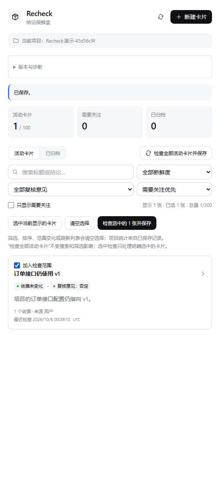
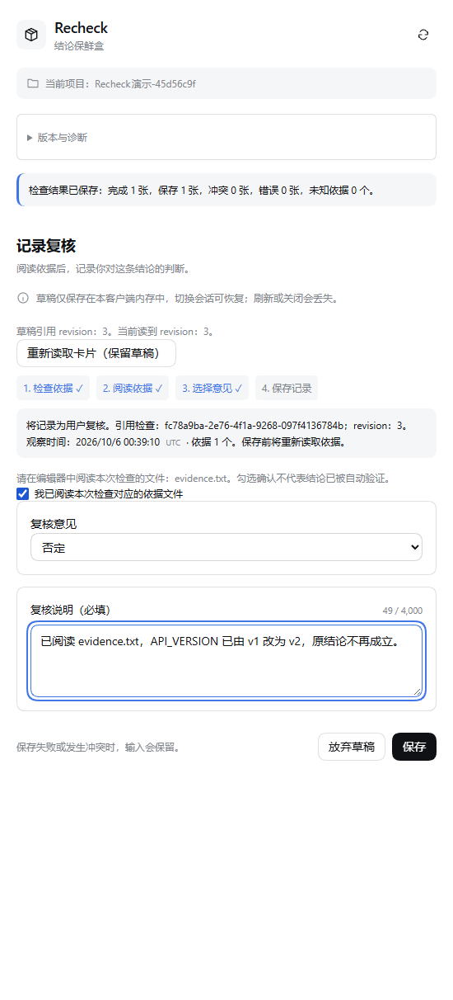
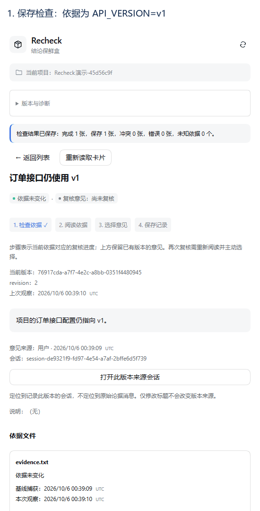

# Recheck · 结论保鲜盒

[](https://github.com/InInNHD/dsh-recheck/actions/workflows/ci.yml)

[English](README.en.md) · [下载 beta 安装包](https://github.com/InInNHD/dsh-recheck/releases) · [安装指南](docs/12-installation.md) · [问题反馈](https://github.com/InInNHD/dsh-recheck/issues)

**非官方项目，由社区成员独立开发和维护。**

给项目结论绑定文件依据，在依据变化后提醒复核。Recheck 提供一个 `recheck` 工具与 DSH 原生右侧栏；卡片操作不需要额外模型调用。

当前版本 **0.1.0-beta.1**：增加复核意见筛选、稳定排序、显式选中批量检查和“检查 → 阅读 → 选择意见 → 保存”步骤。保持八种业务动作与 schema 1，见 [beta.1 验收说明](docs/19-beta1-acceptance.md)、[兼容清单](compatibility.json) 和 [对应 Release](https://github.com/InInNHD/dsh-recheck/releases/tag/v0.1.0-beta.1)。安装使用固定版本；npm `beta` 为预发布渠道。发布须通过 Windows/Ubuntu × 两个精确宿主的 CI；该提交的运行和结果见 Release。Web 验收不代表其他 Desktop 组合已验证。





## 安装

以下命令固定使用 beta.1 与基线宿主 0.2.0-rc.2。其他组合及 alpha.6 回退说明见 [beta.1 安装与回退](docs/19-beta1-acceptance.md#安装与回退)。截图与演示来自真实 beta.1 隔离样例项目。

从 Releases 下载 `dsh-recheck-0.1.0-beta.1.tgz` 和同名 `.sha256` 文件，校验后通过匹配版本宿主安装。普通 Web 用户可从 npm 安装固定版本：

```powershell
npx.cmd --yes --package=@deepseek-ai/dsh@0.2.0-rc.2 dsh plugin --profile web add dsh-recheck@0.1.0-beta.1
npx.cmd --yes --package=@deepseek-ai/dsh@0.2.0-rc.2 dsh web
```

使用下载的 tgz 时，在安装包所在目录运行：

```powershell
npx.cmd --yes --package=@deepseek-ai/dsh@0.2.0-rc.2 dsh plugin --profile web add './dsh-recheck-0.1.0-beta.1.tgz'
npx.cmd --yes --package=@deepseek-ai/dsh@0.2.0-rc.2 dsh web
```

桌面用户使用桌面应用自带 CLI 或插件管理入口安装到 `desktop`，然后重启桌面应用。不要使用不匹配的全局 CLI。完整命令、备份、卸载和回退见 [安装指南](docs/12-installation.md)。发布包包含构建产物；GitHub 自动生成的源码 ZIP 需要自行构建。本版提供 npm `beta` 发布渠道，也保留 GitHub Release 安装包。

## 一分钟演示



上图使用一次性样例 `evidence.txt`：`API_VERSION=v1` 改为 `v2`，检查提示依据变化，阅读后主动否定原结论并保存说明。截图按流程生成并停留展示，无模型判断。

1. 创建卡片：标题“重试不会重复扣款”，填写结论，绑定 1–8 个项目相对文件路径。
2. 点击检查，显示“依据未变化”。
3. 修改样例依据文件，再检查，显示“依据已变化”。
4. 阅读依据后确认已阅读，主动选择支持、否定或不确定，并填写复核说明。
5. 查看历史，生成 Markdown 预览、复制或导出为新文件。

**依据未变化不证明结论正确。** 文件新鲜度和复核意见独立；复核前会重新读取依据并拒绝过期 revision 或 checkId。演示操作建议在专用样例项目中进行。

Agent 创建示例：

```json
{"action":"create","title":"重试不会重复扣款","claim":"相同 requestId 的重试只扣款一次。","files":["src/payment.ts","tests/retry.test.ts"]}
```

其他 action：`list/get/edit/check/review/archive/export`。`edit/review/archive` 和单卡 `check` 使用最新 `expectedRevision`；`review` 同时引用最新持久检查的 `checkId`。beta.1 新增 `check scope:selected`，传入 1–100 个 `{cardId, expectedRevision}`；逐卡返回冲突与实际保存情况。列表支持意见筛选及 attention/checked/updated 排序。工作区、来源、指纹与时间来自可信宿主，不能由参数指定。

## 数据与边界

- 数据仅存于项目 `.dsh/recheck/cards.json`；不存依据正文，不发送业务网络请求，不自动执行测试或判断结论真假。
- 业务 I/O 使用宿主 `ctx.fs`、观察政策与沙箱；拒绝逃逸、符号链接、目录联接和插件存储作为依据。
- 原子写入与版本 guard 保护存储；损坏 JSON、未来 schema 和超限存储不会被清空。
- 只读模式支持读取、复制导出和显式 `persist:false` 临时检查；临时结果不可用于持久复核。
- 上限：100 活动卡片、200 总卡片、每卡 20 版本、每依据 2 MiB、存储 8 MiB；批量检查最多 200 唯一文件、64 MiB 和 10 秒，未覆盖项显示 unknown。
- 标题、结论和说明分别最多 120、2,000、4,000 个 Unicode code point。各文件分别观察，不提供全项目同一时刻快照。
- 草稿仅存在客户端内存；刷新或关闭会丢失。不承诺多 Host 同时写同一存储、共享网络盘或远程文件系统。
- 原子保存后收到取消时，先重新读取卡片再决定是否重试。

备份前停用插件或确认没有写入，再复制数据文件。恢复前保留当前文件副本并核对 schema 与结构；卸载保留项目数据。

## 开发与验证

```powershell
git clone https://github.com/InInNHD/dsh-recheck.git
Set-Location dsh-recheck
npm.cmd ci
npm.cmd run check
npm.cmd run test:package
npm.cmd pack
```

`check` 包含 Host/Client 类型检查、两端构建及 47 项真实 FS/Native/Node PTC、诊断和依据反馈测试；`test:package` 在独立配置中安装实际 tgz、运行该宿主的真实 SDK 测试、启停 20 次、卸载重装、回退 alpha.6 再升级，并验证数据与历史保留。它只操作忽略的 `.integration` 目录。`prepack` 会执行 `check`。

指定宿主：`npm run test:package -- --host 0.2.1-alpha.1 --web`。侧栏“版本与诊断”按需读取状态，可复制不含项目路径和业务内容的摘要；允许写入的策略仍受实际文件权限约束。宿主版本匹配不代替平台验收，未验证组合见兼容清单。

开发试用：`node scripts/install-local.mjs` 安装到独立 `recheck-web` 配置；启动方法见安装指南。额外检查：`npm run benchmark`、`npm run test:package -- --web`。Desktop 验收需显式指定已安装应用：`node scripts/desktop-smoke.mjs --app '你的应用路径'`。

`src/index.ts` 注册宿主与可信会话；`recheck.ts` 实现操作和提交队列；`io.ts` 处理安全读取；`store.ts` 校验与原子存储；`export.ts` 生成安全 Markdown；`client.tsx` 提供原生侧栏。无数据库或后台 watcher。

[贡献说明](CONTRIBUTING.md) · [变更记录](CHANGELOG.md) · [Git 与发布流程](docs/11-version-management.md) · [历史实现验收](docs/09-implementation-and-acceptance.md)

后续开发建议见 [插件生态调研与版本路线图](docs/16-ecosystem-research-and-roadmap.md)（2026-10-04，规划内容不代表已实现）。

旧学习文档与 `learning/` 保留为历史资料，不能用其中示例配置覆盖当前项目。MIT License。
