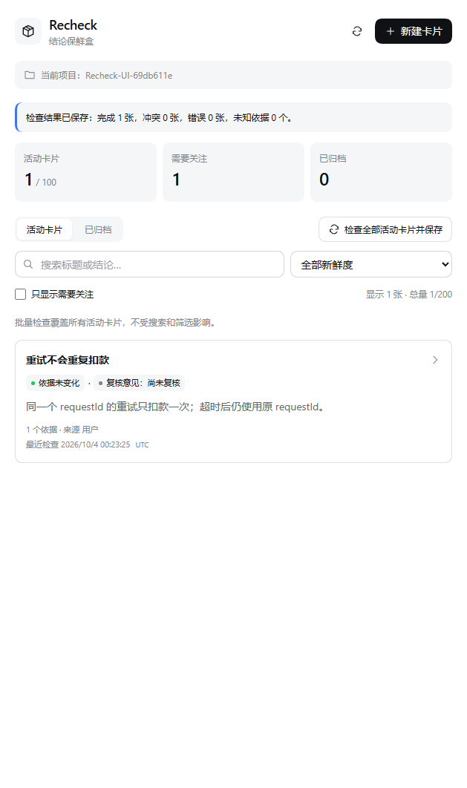
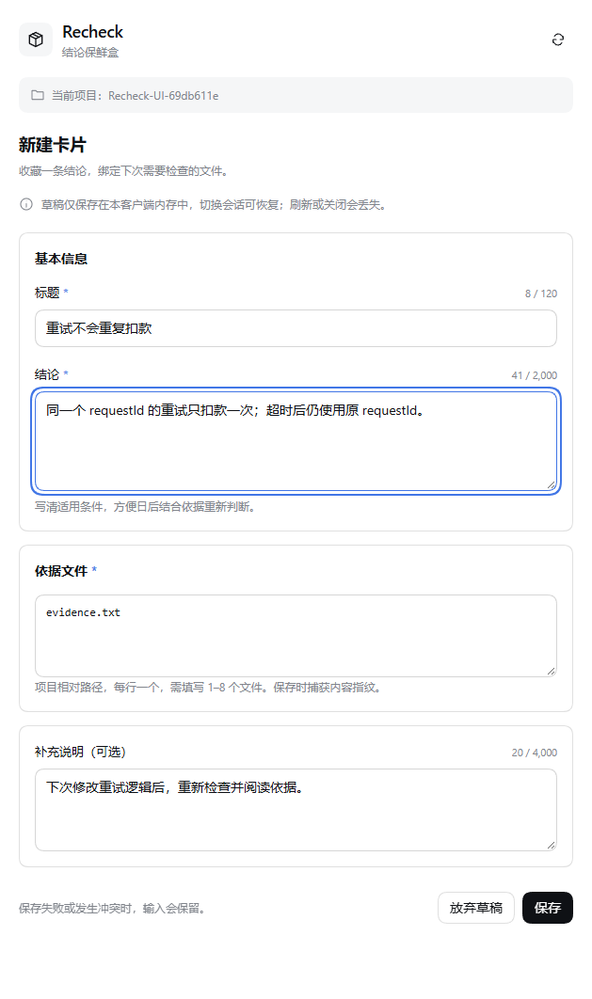
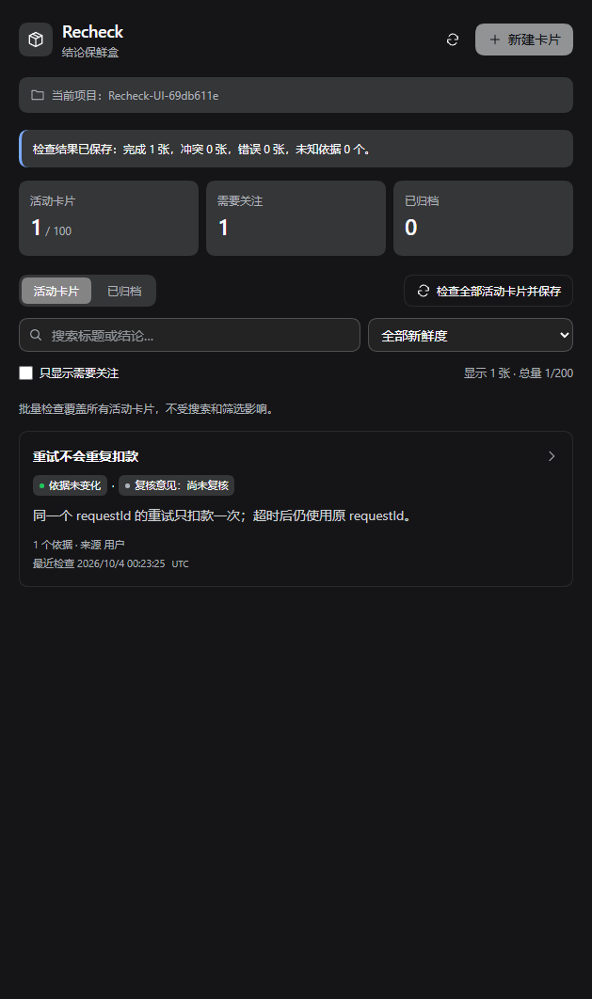
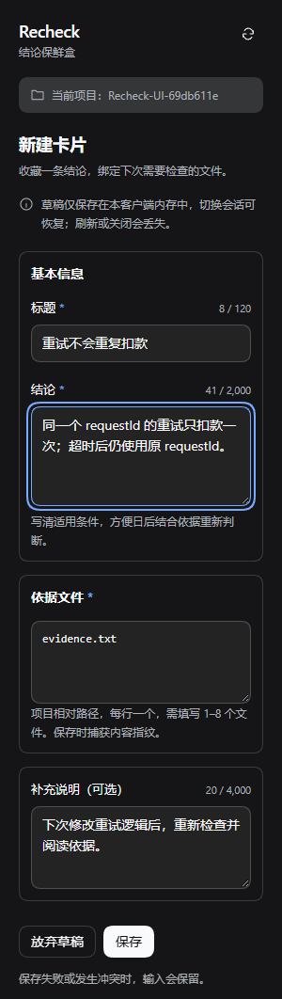

# alpha.4 UI 改版与验收

版本：0.1.0-alpha.4，日期：2026-10-04。宿主：DeepSeek Harness 0.2.0-rc.2。通过 npm alpha 与 GitHub Release 分发，仍为预发布。

## 界面变化

- 主界面：品牌与项目上下文、紧凑的新建/刷新操作、活动/关注/归档统计、活动/归档切换、搜索与新鲜度筛选。
- 卡片：结论摘要、独立的新鲜度和复核意见徽章、依据数量、检查时间；空列表和无匹配结果提供相应入口。
- 新建与编辑：基本信息、依据文件、补充说明分组，标题/结论/说明的 Unicode code point 字数提示；简化草稿提示并保留丢失条件说明。
- 主题：颜色、圆角、悬停、焦点与主按钮采用宿主 `--dsw-*` 变量。14px / 22px 基础排版、32px 控件、300px 窄栏适配；无新增运行时依赖。
- 详情、复核、历史及导出同步使用紧凑样式。持久存储格式、Host API、权限检查与并发控制保持 schemaVersion 1。

## 截图

截图来自真实 DSH Web 中的专用样例项目，不使用静态模拟页面。






## 已验证范围

- `npm run check`：Host / Client 类型检查、构建和 29 项自动化测试通过。
- `node scripts/ui-smoke.mjs`：真实宿主主题、14px 字号、emoji 字数、Tab 顺序、浅色/深色、300px 新建及列表无横向溢出、新建保存、文件检查、筛选与清除、无页面异常。
- 完整 Web 回归 14 项通过，包括宿主认证、主动复核、冲突保留输入、导出拒绝覆盖、归档恢复、只读临时观察、项目草稿隔离与 UTC 展开。
- 真实 Electron 桌面回归 12 项通过：安装文件一致、原生项目绑定、创建/检查/复核、并发冲突、导出拒绝覆盖、归档恢复、历史、UTC、搜索与无页面异常。使用独立 `desktop` 配置与 Electron 用户数据，监听端口 19388，日常客户端继续使用原端口。
- 本版本的 UI 验证限于本机 Windows / DSH 0.2.0-rc.2；先前版本的 Ubuntu 结果不能视为本次 UI 的跨平台验收。

测试项目及报告写入忽略的 `.integration`。Web UI 脚本仅终止它自己启动的宿主。桌面验收使用独立 Harness home 和 Electron user-data，文件夹选择结果使用测试夹具，其他宿主功能保持真实。

随后已将 alpha.4 安装到本机日常 desktop 配置，保留原有插件与配置并完成备份。日常配置的 12 项功能测试及 8 项界面/重启检查通过；重启后读取历史、深色模式和 300px 窄栏正常。升级前已有的 3 份专用测试项目存储 SHA-256 保持一致。该结果来自另一会话的真实验收记录，完整私密报告保留在忽略目录，不随包分发。

## 构建与本地试用

```powershell
npm.cmd run check
npm.cmd pack
node scripts/install-local.mjs
node scripts/ui-smoke.mjs
```

`install-local` 安装到源码目录下的独立 Web 配置，日常配置不受影响。

桌面安装：先完整退出 DeepSeek Harness（包括托盘），保留现有 profile 和项目数据备份，再使用桌面应用自带的 CLI：

```powershell
$recheckDesktopCli = 'C:\Path\To\DeepSeek Harness\resources\runtime\cli\bin\dsh.cmd'
& $recheckDesktopCli plugin --profile desktop add dsh-recheck@0.1.0-alpha.4
```

按自己的安装位置替换路径，然后重启客户端，从项目会话右侧栏打开 Recheck。alpha.3 不包含此 UI 改版。升级时安装固定的 alpha.4 版本，或下载对应 GitHub Release 的 tgz；不要把源码 ZIP 当作构建包。

## 公开发布验证

[GitHub Release](https://github.com/InInNHD/dsh-recheck/releases/tag/v0.1.0-alpha.4) · [npm alpha.4](https://www.npmjs.com/package/dsh-recheck/v/0.1.0-alpha.4) · [同提交 CI](https://github.com/InInNHD/dsh-recheck/actions)。Windows/Ubuntu CI 执行类型检查、构建、29 项测试与实际 tgz 生命周期；Ubuntu 另执行真实 Web 流程。细项主题与桌面截图验收范围仍以上述 Windows 实测为准。npm 与 GitHub 使用同一个 tgz，附 SHA-256；旧版本与旧标签不替换。
